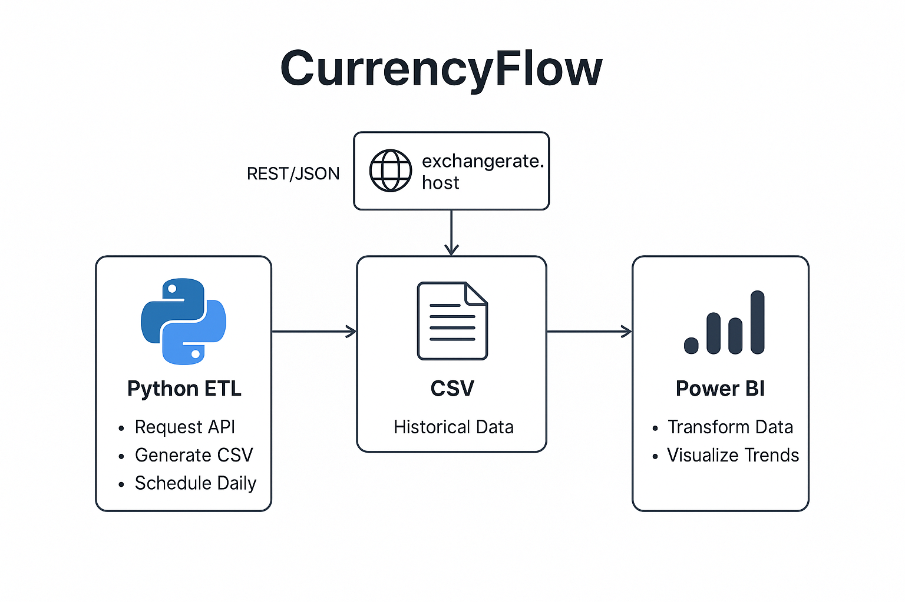

# monitoramento_de_variação_de_moeda

## Visão Geral
Uma solução de coleta, armazenamento e visualização de taxas de câmbio de moedas internacionais. O projeto automatiza a extração de dados de uma API pública, organiza as informações em arquivos CSV históricos e disponibiliza dashboards dinâmicos no Power BI para monitoramento e análise de tendências cambiais.
## Objetivos
- Coletar dados de taxas de câmbio via API.
- Realizar processo de tratamento dos dados para serem disponibilizados em formato de arquivo.
- Integração dos dados com o Power BI para acompanhamento das variações entre diferentes moedas.
## Tecnologias
 - Python 3.0 ou superior
 - https://awesomeapi.com.br/ (100.000 requests free)
 - Power BI
 ## Arquitetura
 
 ## Documentações Utilizadas
 https://pypi.org/project/requests/
 #
 #
 #
 # currency_variation_monitoring

 

## Overview
A solution for collecting, storing, and visualizing exchange rates for international currencies. The project automates data extraction from a public API, organizes the information into historical CSV files, and provides dynamic dashboards in Power BI to monitor and analyze currency trends.
## Objectives
- Collecting exchange rate data via API.
- Performing data processing to make it available in file format.
- Data integration with Power BI to monitor variations between different currencies.
## Technologies
 - Python 3.0 or higher
 - https://awesomeapi.com.br/ (100.000 requests free)
 - Power BI
 ## Architecture
 
 ## Documentation Used
 https://pypi.org/project/requests/